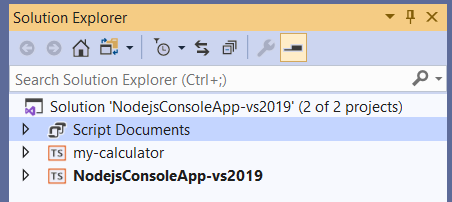
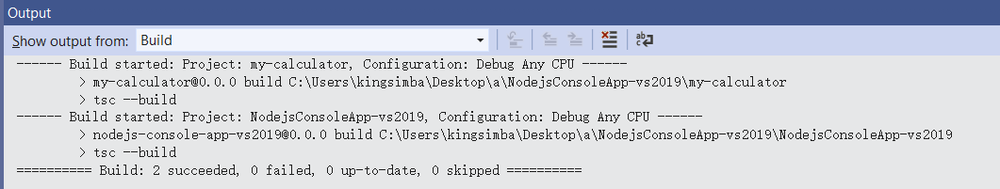
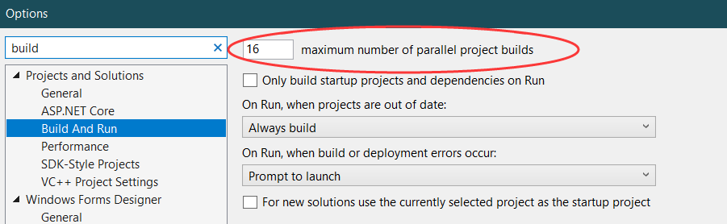
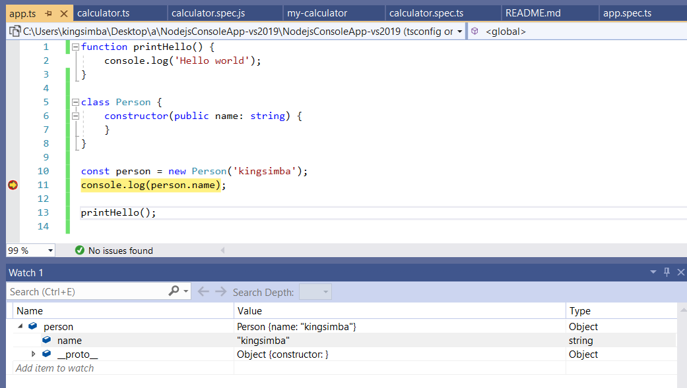
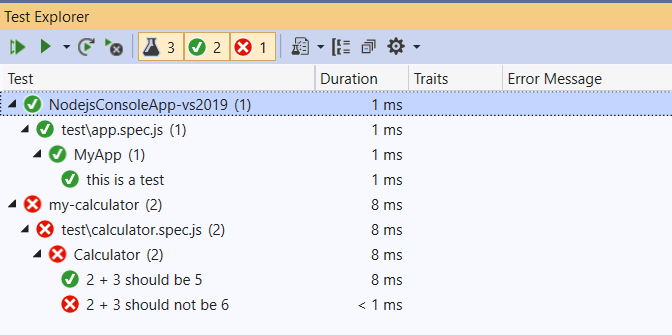
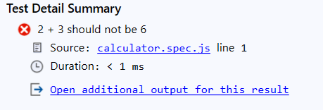

# NodejsConsoleApp-vs2019<!-- omit in toc -->

Summary of TypeScript supports in Visual Studio 2019. (Updated in 2020-July-07)

- [Background](#background)
- [Multi-project Support](#multi-project-support)
- [Building](#building)
- [Debugging](#debugging)
- [Testing](#testing)

## Background

I'd like to use Visual Studio 2019 for really large projects.

As a large project, I hope:

 * It should be divided into many sub-projects.
 * Sub-projects have their own teams and can be compiled/published(as npm JS package) individually.
 * Can compile/test related-projects in a single window.

## Multi-project Support

* Add projects into solution ✅
* Define project dependency ✅

  

* Compile related projects (Partially ✅)

  There is no direct support. But it can be achieved with `npm link`

  ```
  $ cd my-calculator
  $ npm link
  npm WARN my-calculator@0.0.0 No repository field.
  npm WARN my-calculator@0.0.0 No license field.

  up to date in 0.293s

  $ cd NodejsConsoleApp-vs2019
  $ npm link my-module
  C:\Users\kingsimba\Desktop\NodejsConsoleApp-vs2019\NodejsConsoleApp-vs2019\node_modules\my-calculator 
  -> C:\Users\kingsimba\AppData\Roaming\npm\node_modules\my-calculator
  -> C:\Users\kingsimba\Desktop\NodejsConsoleApp-vs2019\my-calculator
  ```

  If someone don't have access to the source code 'my-calculator', he can install from a private npm registry with 'npm i my-calculator'.

## Building

* Build ✅

  

* Clean ✅
* Fast skip ❌

  'tsc --build' will be executed even no file is modified since last build.
  I hope the it can be skipped as in C/C++ compiling.

* Parallel build ❌
  
  When I press Ctrl+Shift+B, all projects are built in succession.
  Seems the parallel building feature is not implemented.

  

## Debugging



* Choose main project ✅
* Debug main project(F5) ✅
* Breakpoints ✅
* Show local variables & watch variables ✅
* Modify variable value when paused ✅

## Testing

* Mocha support ✅
* Test Explorer ✅
  * Show tests as a tree ✅
  * Top level nodes should be projects ✅

  

* Run tests

  * Show the succ/fail status of tests ✅
  * For failed tests, locate file & line through source-mapping. ❌

    It only shows the name of the javascript file, not the TypeScript file.

    
  
  * Show detail of failed test (partially ❌)

    The 'Test Detail Summary' doesn't show details(expect, actual, message) directly. You have to click 'Open additional output for this result' to see details.

  * Show assertion error detail along with code. ❌

note: The project is created according to https://docs.microsoft.com/en-us/visualstudio/javascript/unit-testing-javascript-with-visual-studio?view=vs-2019